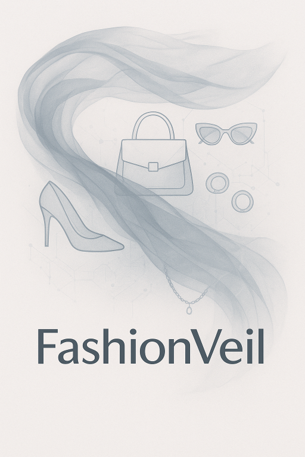

# FashionVeil
### Fashion apparel dataset with occlusion level annotations for clothes and accessories




This repository contains instructions and code describing how to download the novel FashionVeil dataset, train new models, and evaluate existing and new fashion apparel detection models. It provides instructions on how to reproduce the main results from my thesis, which is publicly available at: 📝 (after release to UU thesis repository)

Furthermore, I've created a Huggingface space in which you can run inference on your own images on RF-DETR-B and RF-DETR-L models trained on Fashionpedia: [![Generic badge][logo-hf_spaces]][fv-hf_spaces]
### Installation

Create a virtual environment named `fv` (short for FashionVeil):

```bash
python3 -m venv fv
source fv/bin/activate
git clone https://github.com/DatSplit/FashionVeil.git
pip install -e .
```

### Usage
Follow the instructions in `references/` for instructions on [downloads](references/01_dataset_downloads.md), [training](references/02_training.md), [inference and evaluation](references/03_inference_and_evaluation.md), and [visualization](references/04_visualization.md).


[logo-hf_spaces]: https://img.shields.io/badge/🤗-Demo-blue.svg?style=plastic
[fv-hf_spaces]: https://huggingface.co/spaces/DatSplit/FashionVeil